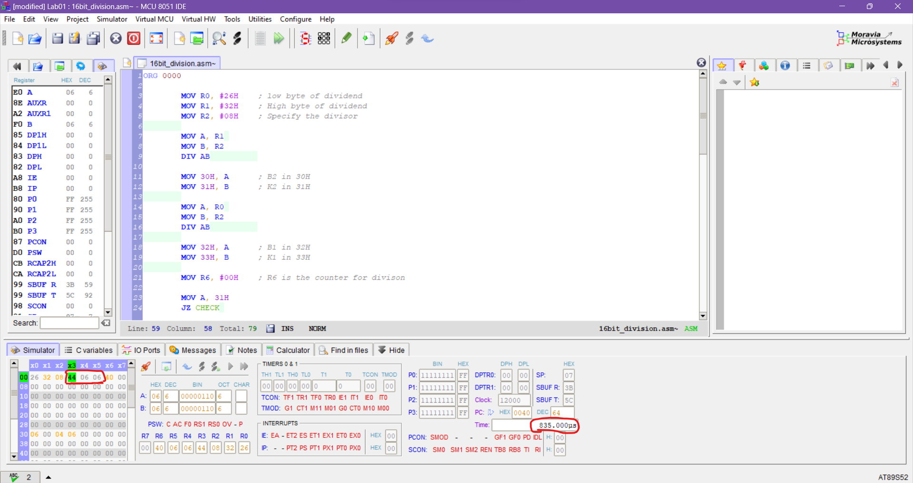

 

  <h3 align="center">16 Bit Divison</h3>

  

    An algorithm  to do 16 bit divison calculations on 8 bit microcontrollers 
     
     
  

## Concepts Used in This Project

* 8051 microcontroller assembly language
* MCU 8051 IDE

## Purpose

The aim of this project is to divide an 16-bit number by an 8-bit number on 8051 microcontroller. 
8051 (MCS-51) is an 8-bit microcontroller. That means, it has a 8-bit data bus. Therefore, numerical calculations for higher bit numbers requires special algorithms. 

## Algorithm & Methodology

In order to do the divison calculation a method named successive substraction is used in this project.

In this method divisor is repeatedly substracted from dividend until the dividend becomes smaller than the divisor. Number of substractions gives us the result for the quotient. Remaining dividend gives us the result for the remainder. 

## Design Specifications

Dividend is an 16-bit number. Low byte stored in R0 and High byte stored in R1. Divisor is stored in R2. 

The total number of substractions are counted in R6.

The queotient is stored in R4:R3.

## Simulation Results

The number 0x3226(R1:R0) is divided by number 0x08(R2):
* The quotient is 0x0644(R4:R3)
* The remainder is 0x06(R5)
* Calculation time 835µs
